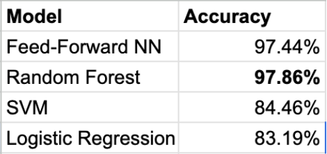

# Wildlife Trap Camera Classifier

A two-stage pipeline that classifies species from camera trap images and uses those classifications to predict whether the species is endangered. Built for EE456 at Penn State.

Camera trap images are low quality, random angles, often poor lighting. The challenge wasn't just building a classifier — it was doing it efficiently enough to be practical on a dataset this size.

---

## How it works

The pipeline has two stages.

**Stage 1 — Species classification**
Images are converted to grayscale and run through Canny edge detection, then passed through a CNN that outputs the top 5 species predictions with confidence scores. Edge detection turned out to make a real difference here — reduced the dataset from 7.8GB to 124MB and cut training time by about 66% without hurting accuracy.

**Stage 2 — Endangered prediction**
The CNN's top 5 confidence scores, predicted labels, and category information (mammals, snakes, invertebrates, etc.) go into a feed-forward network that predicts whether the image contains an endangered species.

The endangered status isn't directly readable from the image — it gets reverse-engineered from the species classification. That's the interesting part.

---

## Results

| Model | Accuracy |
|---|---|
| CNN (species classification) | 92.22% val / 99.44% train |
| Feed-Forward NN (endangered prediction) | 97.44% |
| Random Forest | 97.86% |
| SVM | 84.46% |
| Logistic Regression | 83.19% |

CNN hits benchmark performance (99.6%) in 10 epochs vs the benchmark's 50. Random Forest edges out the feed-forward network on stage 2 — the report goes into why.



[▶ Watch Report](https://drive.google.com/file/d/1CPr5ByE0y6lfpSP74mAtbpxVqXWa1N2r/view?usp=drive_link)

---

## Dataset

118,554 images across 45 species from AHDriFT camera traps deployed across Ohio. 168 unique camera locations. Dataset links are in `Data/`.

Notable species: Eastern garter snake (31,899 images), song sparrow (14,567), meadow vole (14,169).

Source: [lila.science — Ohio Small Animals Dataset](https://lila.science)

---

## Repo structure

```
wildlife-trap-camera-classifier/
├── Code/               # CNN, feed-forward network, preprocessing scripts
├── Data/               # Dataset links and metadata CSVs
├── Results/            # Accuracy plots, pipeline diagram
├── Demo/               # Demo video
└── Report/
    └── EEFinalReport.pdf
```

---

## Setup

**1. Clone the repo**
```bash
git clone https://github.com/Avanishx05/wildlife-trap-camera-classifier.git
cd wildlife-trap-camera-classifier
```

**2. Install dependencies**
```bash
pip install -r requirements.txt
```

**3. Download the dataset**

Follow the links in `Data/` to get the Ohio Small Animals Dataset from lila.science. Place images in `Data/images/`.

**4. Run**
```bash
python Code/preprocess.py   # edge detection + preprocessing
python Code/train_cnn.py    # train species classifier
python Code/train_ff.py     # train endangered predictor
```

Update file paths in each script to match your local setup before running.

---

## Stack

Python, PyTorch, OpenCV, NumPy, Pandas, Matplotlib, scikit-learn, Google Colab

---

## Report

Full write-up in [`Report/EEFinalReport.pdf`](Report/EEFinalReport.pdf).

---

**Avanish Grampurohit** — [avanishmg05@gmail.com](mailto:avanishmg05@gmail.com) · [LinkedIn](https://www.linkedin.com/in/avanishmg) · [GitHub](https://github.com/Avanishx05)
